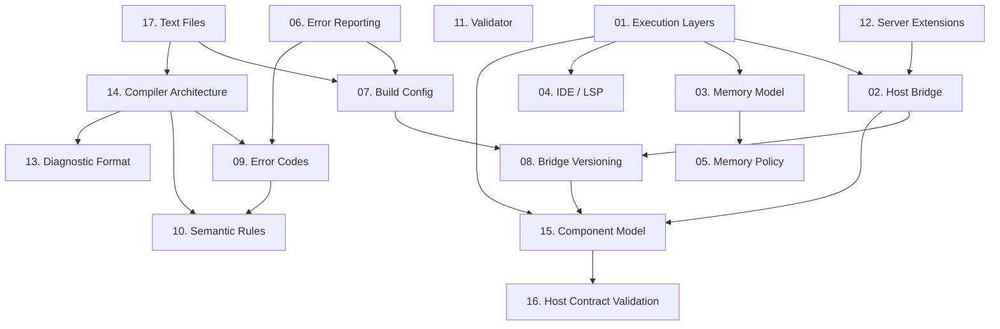

# Platform Architecture

This folder is the **platform contract** — the specifications every Clean host must satisfy and every Clean program can rely on, regardless of where it runs. Read the "Reading order" list below for the shortest path to a full mental model, then treat the rest of the chapters as reference to consult when you need them.

## Reading order

If you're new, follow this path — you'll have the full mental model in an hour or two:

1. **[00 — Runtime Architecture Overview](./00-overview.md)** — the one-page synthesis. Start here.
2. **[01 — Execution Layers](./01-execution-layers.md)** — where each piece of code actually runs (L0 compiler → L5 application).
3. **[15 — Component Model Architecture](./15-component-model-architecture.md)** — the WebAssembly Component Model / WIT foundation the rest of the platform is built on.
4. **[02 — Host Bridge](./02-host-bridge.md)** — the WIT-typed function surface each host must expose to a Clean guest.

Everything else is reference: consult it when you need it.

## Sections

### Foundation

- [00. Runtime Architecture Overview](./00-overview.md) — the one-page synthesis. Read this first.
- [01. Execution Layers](./01-execution-layers.md) — the six-layer model, L0 compiler through L5 application.
- [17. Text Files](./17-text-encoding.md) — the shape of every file the toolchain reads and writes: the UTF-8 invariant and who validates it, byte-order marks, and line-terminator preservation.

### Bridge and runtime contracts

The four documents below define the host boundary together. Different scope, one contract.

- [02. Host Bridge](./02-host-bridge.md) — the WIT function surface: `wasi:*`, `clean:bridge/*`, `clean:host/*`, `clean:library/*`.
- [08. Bridge Versioning](./08-bridge-versioning.md) — SemVer rules for WIT packages, compiler resolution, host declaration, deprecation.
- [15. Component Model Architecture](./15-component-model-architecture.md) — packaging, worlds, resolution rules, and the toolchain isolation guarantee (§15).
- [16. Host Contract Validation](./16-host-contract-validation.md) — how tools detect capability and version mismatches between guest and host (semantic drift is explicitly out of its scope).

### Memory, IDE, error surface

- [03. Memory Model](./03-memory-model.md) — linear memory layout, bump allocator with arena scopes, string/list representation, host-backing contract (mechanism: [ADR-0007](../01%20governance/decisions/0007-host-memory-backing.md)).
- [04. IDE / Language Server](./04-ide-lsp-architecture.md) — LSP as single source of truth; editor extensions as thin clients.
- [05. Memory Policy](./05-memory-policy.md) — tiers, growth strategy, reset policies, trap-on-grow enforcement (mechanism: [ADR-0007](../01%20governance/decisions/0007-host-memory-backing.md)).
- [06. Error Reporting](./06-error-reporting.md) — five-stage lifecycle, WIT-typed reports, consent-gated privacy model, wasmtime-sourced diagnostics.

### Build and diagnostics

- [07. Build Configuration](./07-build-config.md) — `clean.toml` schema, targets, profiles, folder scoping, workspaces.
- [09. Error Code Registry](./09-error-codes.md) — every diagnostic code the compiler and runtime can emit.
- [10. Semantic Rules](./10-semantic-rules.md) — the numbered compile-time and runtime rules that back each diagnostic code.
- [13. Diagnostic Format](./13-diagnostic-format.md) — message anatomy, structured suggestions, JSON schema, LSP mapping, `cln explain`, style guide.

### Validation, extension, compiler

- [11. Standard Library — Validator](./11-stdlib-validator.md) — the `validator` namespace: DSL syntax, types, function reference, WASM layout.
- [12. Server Extensions](./12-server-extensions.md) — Layer 3 host functions for HTTP servers: routing, SSE, request context, session, auth, diagnostics capture.
- [14. Compiler Architecture](./14-compiler-architecture.md) — the L0 compiler: JSON request document, sequential passes, determinism invariants, build manifest, compiler API operations (user surface: Manager §00.3).

## How the sections fit together

## Relationship to the language spec

The platform sections are the **contract** underneath the language spec's semantics. The language spec answers "what does my Clean code *mean*?"; the platform sections answer "and what does the machine that runs it look like?". Both are authoritative and stay in sync.

When adding a language feature that touches the host boundary, check that no platform section needs updating in the same commit.

## Authority and change control

These sections are governed by the documentation principles — precedence and conflict handling per [DOC-11](../01%20governance/00-documentation-principles.md) — and by the [architecture boundaries](../01%20governance/01-architecture-boundaries.md): changes require developer approval. Adding new bridge functions, new memory tiers, new build targets, or new consent levels is an ADR, not an implementation choice.

---

## Metadata

- **Status:** Accepted (2026-08-01)
- **Audience:** Host implementers, compiler and runtime maintainers, bridge authors
- **References:** [the repository index](../README.md), [01 governance / 00 — Documentation Principles](../01%20governance/00-documentation-principles.md), [04 language](../04%20language/README.md)
